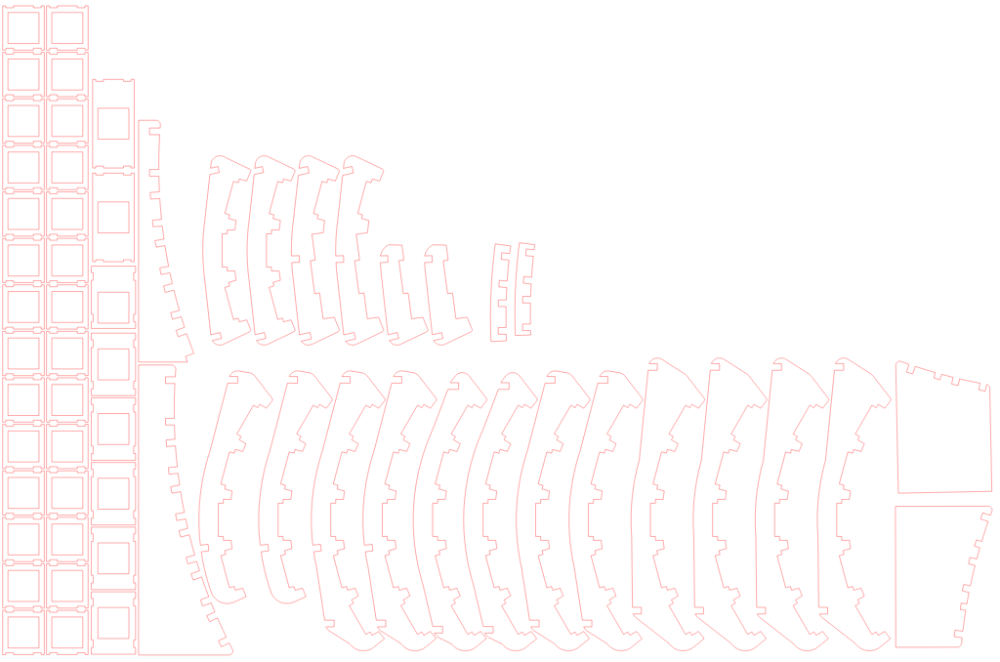

# dactyl–flatpacked

A reimagined [dactyl](https://github.com/adereth/dactyl-keyboard) using slotted
rib pieces to create the countoured surface instead of a solid 3D printed part.

**Note:** the current state of the master branch doesn't accurately reflect the
version of the keyboard that I have built. Since then I've started to work on a
low profile version and have refactored most of the code as well as re-designed
the rib pieces and thumb cluster. Check out the tag _original_ to see more or
less the original code used to generate the initial laser cut template.

## Inspiration

When I first head about the dactyl keyboard I had been realizing that my typing
habits have been awful for years despite being able to type quickly and with few
mistakes. The dactyl seemed to address a lot of the problems but seemed like a
big investment to either order quality printed parts or to attempt printing it
myself.

Rather than spend moeny directly on something I may not have actually enjoyed in
the end, I decided to try creating a design that could match the original
contours using many smaller pieces that could be reliably cut from wood or
acrylic. The time to design and assemble the structure myself was likely more
expensive but the experience was invaluable.

## Execution

The first step was rewriting the positioning code in OpenSCAD directly. Clojure
is interesting, OpenSCAD is... flawed, but the pipeline of _lein_ to _clojure_
to _scad-clj_ to _OpenSCAD_ was a lot of trouble and made debugging painful.

Once I had OpenSCAD code that matched the original layout I could throw most of
the rest of the code away; I didn't need to create a 3d printable plate or case
or anything, the rest was from scratch.

I designed curved supports for each column of keys with slots at the front and
back allowing each column to connect to a common front and back row support. The
shorter finger and thumb columns don't reach the row supports and instead use a
small support connecting it directly to the adjacent column.

With the design finished I created another file to import each part rib support,
cross support, an key plate, transformed to be co-planar with the XY plane, and
projected to a number of 2D shapes. I exported the result to SVG from OpenSCAD
and moved to Inkscape to clean up the result before passing along to a local
company for laser cutting.

## Wiring and Programming

> TODO, add more details and pictures here

Wiring was painful. I think I could have gotten away with thinner and shallower
rib pieces that would've made it easier to get in with my soldering iron. My
design included small gaps that I hope would allow me to snake magnet wire along
each row of switches, but that didn't work out. I had the idea to run ribbon
cables down each column to connect the rows in a more convoluted way which was a
mess but it worked. If I did this before gluing all of the columns to the cross
supports I might have had an easier time but overall I think it woulve been
smarter just to run wires across the columns and be done with it.

The firmware wasn't anything terribly special. I copied the dactyl manuform code
from the QMK repo and modified it to match the physical layout of the original
dactyl. This was obnoxious because I had to hardcode changes that ideally could
have been configuration (the physical layout of the dactyl, but the manuform's
use of two pro micros instead of a teensy and IO expander).

## Results

I've been using my dactyl keyboard at work for several months now and quite like
it. The way I describe it to other people is:

> The keys are where my fingers want to be.

It's hard to say how much of this is unique to the dactyl design or specifically
which aspects of the design. The main features I'll harp on is column-stagger
instead of row-stagger and, by extension, column depth offsets to match (partly)
different lengths of finger.

A few issues:

### Thumb Cluster

There are keys that I don't really care to reach, which is fine for toggles, I
guess, but I also feel that the 2h keys use up valuable space. It's nice that
there are cheap ergodox keysets readily available to use in my keyboard but if I
were to do it again I'd work on making things more compact.

### Gaps Between Keys

I think this is my own fault. The original dactyl was designed for SA keycaps
which are significantly taller than the XDA profile I chose. This is a problem
because much of the calculations for key positioning are based on the height of
the keys and the height (thickness) of the plate. Taller keys need a higher
radius to fit in the same curve which means my keys end up spaced out. This is
one of the areas where the dactyl code could be better documented.

Unfortunately I'm realizing that had I worked off of the dactyl manuform fork I
might have been able to better understand these details and account for them.
The manuform fork seems to use very clear variable names and introduces even
more for better configurability.

### Height

This is possibly my biggest gripe.

This is kind of the nature of the beast of a non-flat keyboard layout. With the
degree of curvature and the minimum height for the lowest keys (this includes
the combined height of the keycap and keyswitch, down to the electrical contacts
underneath) you end up with a keyboard that is significantly taller than, say, a
typical Apple bluetooth keyboard. On top of my desk I need to raise my wrists
quite a bit so that my hands can hang downward. A better solution is to put the
keyboard on a lowered tray, or make sure your chair can be comfortably raised
high enough to compensate.

## Next Up

I'm working on a redesign using kailh low profile switches and keycaps, with a
reduced curvature on the main cluster. This should help keep the keyboard height
reasonable. It also redesigns the thumb cluster using 1u keys and increases the
curve so that the innermost keys end up being more vertical, hopefully making
the outer thumb columns easier to reach.
