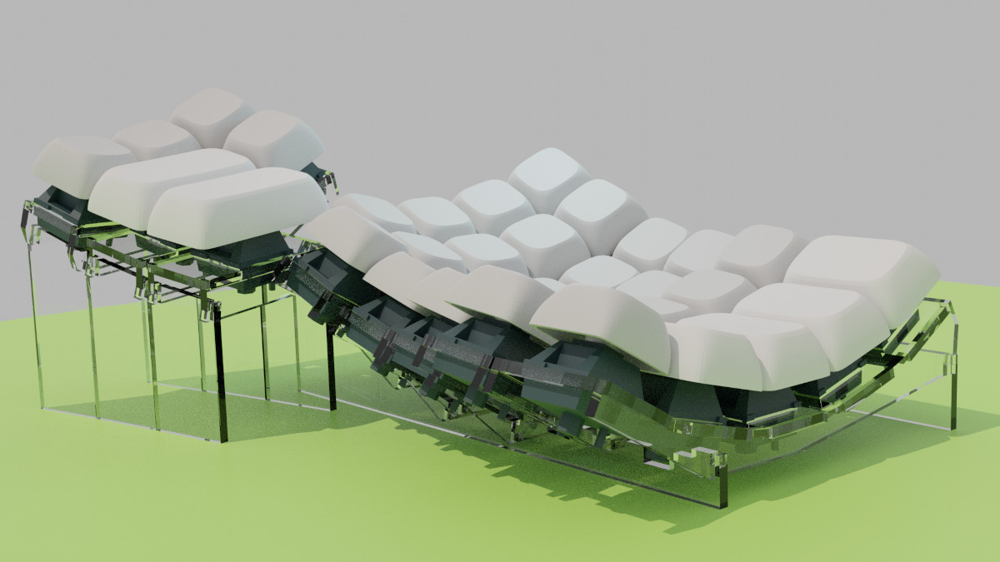

# dactyl–flatpacked

A reimagined [dactyl](https://github.com/adereth/dactyl-keyboard) using 2D
slotted pieces instead of 3D printing.

**Note:** I built this keyboard years ago with code that has since changed
considerably. The current state of the master branch is still a work in progress
and hasn't been tested. I don't have immediate plans to build a new keyboard
from this design in the near future but the refactor and redesign is a fun
project anyway, and hopefully of some use/interest to you.

If you want to see the original code and cutting template look at the tag
`original`.

## The Idea

Use two dimensional pieces of laser cut acrylic, slotted together orthogonally,
to create the Dactyl keyboard shape.

When I started this project the cost to have a Dactyl printed by a third party
seemed prohibitively expensive and the printer I had access to was not up to the
challenge. Neither of these restrictions are true today but this was pretty fun
to work on anyway.

## Recent Changes

This iteration still makes the Dactyl keyboard shape but there are significant
differences:

1. Place column supports on either side of the switch instead of beneath it.
    This requires thinner material but the original 3mm of acrylic was already
    more than thick enough. The current design is 2mm and things seem to fit
    together nicely.
2. Fix the row/column radius calculations to account for keycap height: the
    `mount_width`/`mount_depth` parameters need to reflect the dimensions of the
    keycap at its base in order to get the correct spacing.
3. Construct everything from extruded polygons instead of `hull()`ing and
    `difference()`ing all kinds of geometry. This seems to perform better and
    makes it less weird to try to flatten everything when generating a cutting
    template (which is kind of the whole point anyway).

To simplify the code I've started migrating things over to using the amazing
[BOSL2](https://github.com/revarbat/BOSL2) library.
